# 🕵️‍♂️ Fraud Detection System — Predicting Financial Transaction Fraud with Machine Learning

This project builds a fraud detection pipeline using a real-world-style financial dataset to identify potentially fraudulent transactions. The model is optimized for high recall to ensure that most fraudulent transactions are caught — even at the cost of some false positives.

---

## 📁 Project Structure

| Phase | Description |
|-------|-------------|
| **Phase 1** | Data cleaning and preprocessing (see `clean_data.py`) |
| **Phase 2** | Exploratory Data Analysis (see `explore_data_analysis.ipynb`) |
| **Phase 3** | Feature engineering for behavioral and temporal signals (see `feature_engineering.ipynb`) |
| **Phase 4** | Training and tuning a Random Forest classifier using `RandomizedSearchCV` (see `train_model.ipynb`) |
| **Final**  | Tableau dashboard for showcasing predictions visually (CSV exported)

---

## 📊 Dataset Overview

- Transactions from a fictional bank over several years
- Includes merchant codes, chip usage, credit info, and fraud labels
- Highly imbalanced (fraud ~0.1%)

---

## ✅ Project Goals

- Detect fraud with high **recall** (minimize false negatives)
- Extract **user-level** and **behavioral** features (e.g., chip use, spending z-scores)
- Compare original and refined models with visualizations
- Provide an interactive Tableau dashboard for stakeholders

---

## ✅ EDA Results (Exploratory Data Analysis

### Charts showing inital data analysis for Phase 2
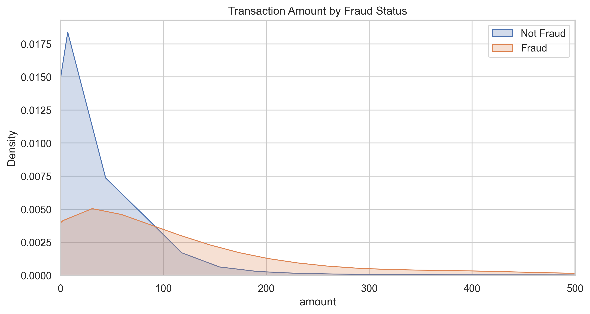
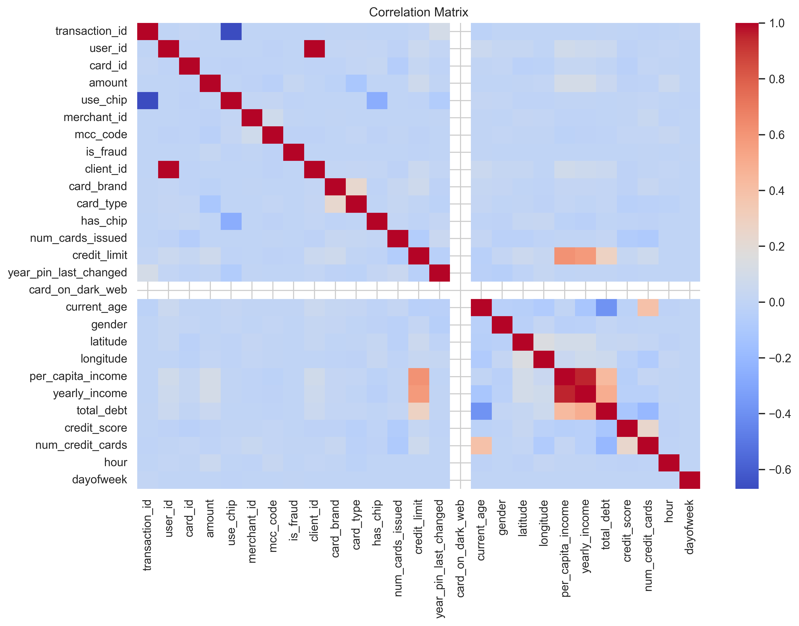
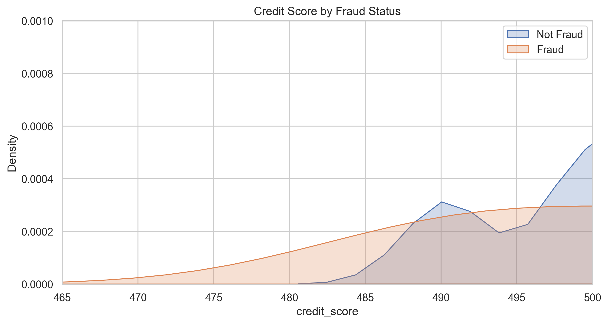
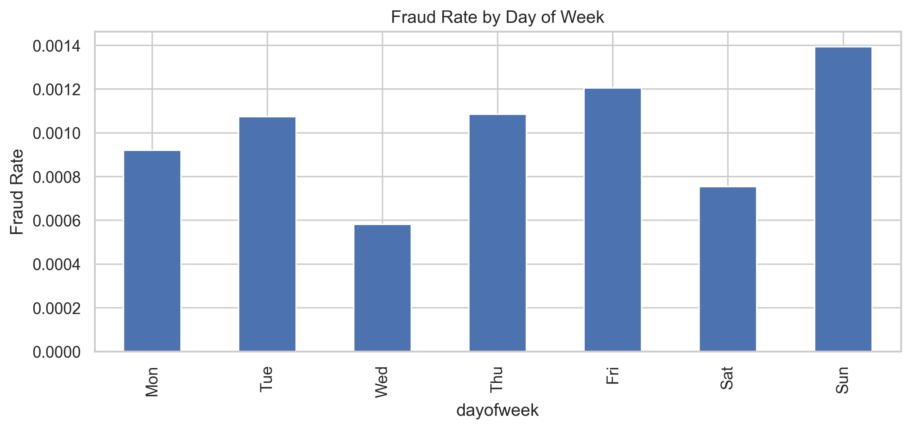
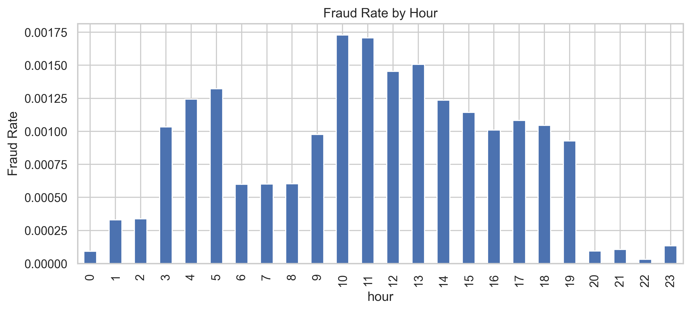
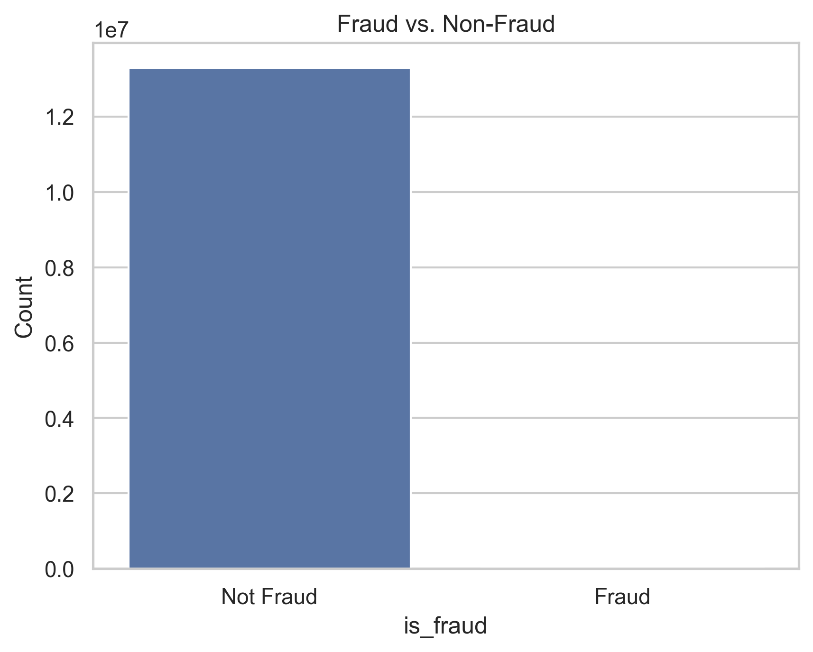
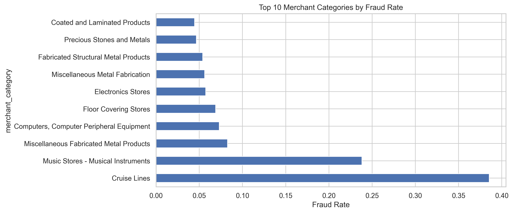
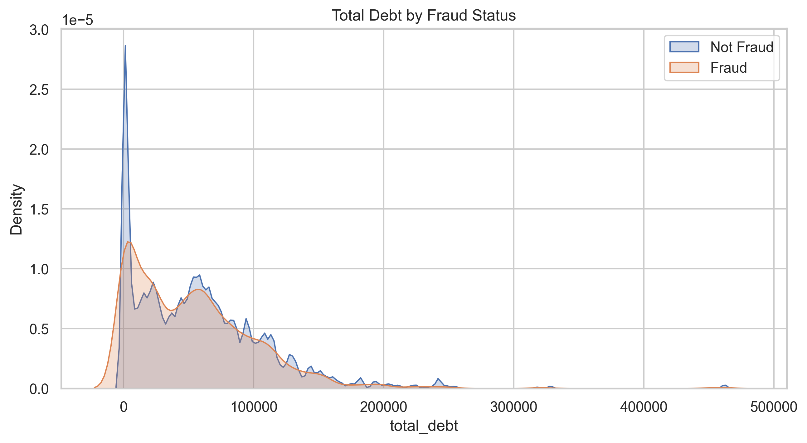

---

## 📈 Model Results

### 🔹 Original Model (No Feature Engineering)
- **Precision (fraud):** 0.5672  
- **Recall (fraud):** 0.1496  
- **F1 (fraud):** 0.2367  
- **Accuracy:** 99.90%

📌 Confusion Matrix:
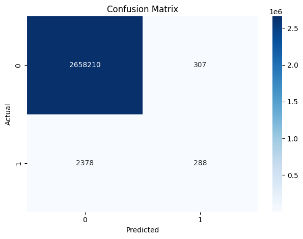  
📌 Feature Importance:
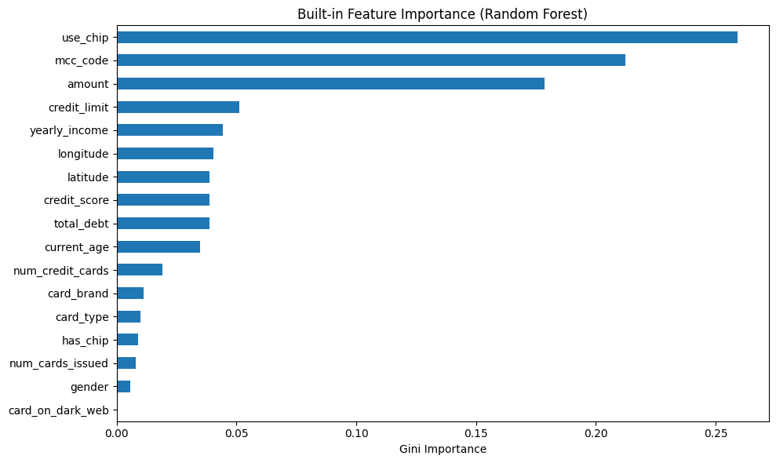

📄 Source: [`original_model_snapshot.txt`](./outputs/train_model_result/original_model_snapshot.txt)

---

### 🔹 Refined Model (Feature Engineered + Tuned)
- **Precision (fraud):** 0.0064  
- **Recall (fraud):** 0.8316 ✅  
- **F1 (fraud):** 0.0127  
- **Accuracy:** 86.95%

📌 Confusion Matrix:
  
📌 Feature Importance:
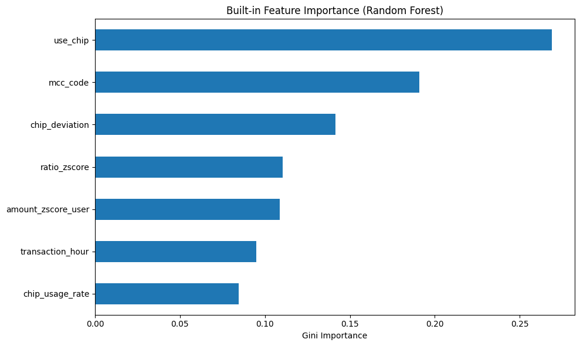

📄 Source: [`refined_model_snapshot.txt`](./outputs/train_model_result/refined_model_snapshot.txt)

---

## 🛠 Key Features Engineered

| Feature | Description |
|--------|-------------|
| `use_chip` | Binary flag for chip usage during transaction |
| `chip_usage_rate` | Historical chip usage frequency per card |
| `chip_deviation` | Whether this transaction deviates from user’s chip norm |
| `amount_zscore_user` | How anomalous the amount is vs. user's history |
| `ratio_zscore` | Z-score of amount-to-credit ratio by card |
| `mcc_code` | Merchant category classification |
| `transaction_hour` | Transaction time to capture night fraud patterns |

---

## 📊 Tableau Dashboard

A fraud monitoring dashboard built with Tableau shows:
- Predicted fraud probability for each transaction
- Risk tiering (High/Medium/Low)
- Merchant trends and fraud hotspots
- Time-of-day and location-based insights

📎 [Link to Dashboard](https://public.tableau.com/)

---

## 💡 How to Run This Project

1. Clone this repo
2. Install dependencies (Python ≥ 3.8, pandas, scikit-learn, matplotlib, seaborn)
3. Run the notebooks:
   - `clean_data.py`
   - `explore_data_analysis.ipynb`
   - `feature_engineering.ipynb`
   - `train_model.ipynb`
4. Load `fraud_predictions_for_tableau.csv` into Tableau

---

## 📁 File Guide

| File | Purpose |
|------|---------|
| `clean_data.py` | Loads and cleans raw CSV and JSON files |
| `explore_data_analysis.ipynb` | Explores data distributions, imbalance, early fraud insights |
| `feature_engineering.ipynb` | Adds behavioral and temporal fraud features |
| `train_model.ipynb` | Trains and tunes a random forest model with `RandomizedSearchCV` |
| `fraud_predictions_for_tableau.csv` | CSV used for Tableau dashboard |
| `images/*.png` | Visualizations and confusion matrices for README |
| `refined_model_snapshot.txt` | Final model performance snapshot |
| `original_model_snapshot.txt` | Baseline model metrics |

